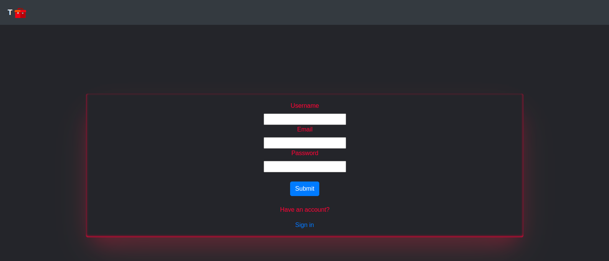
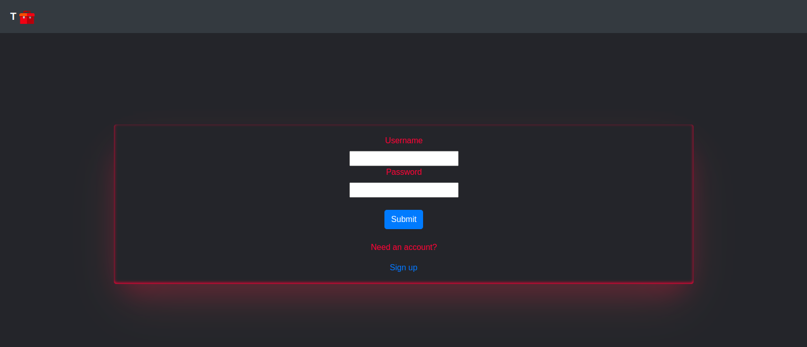
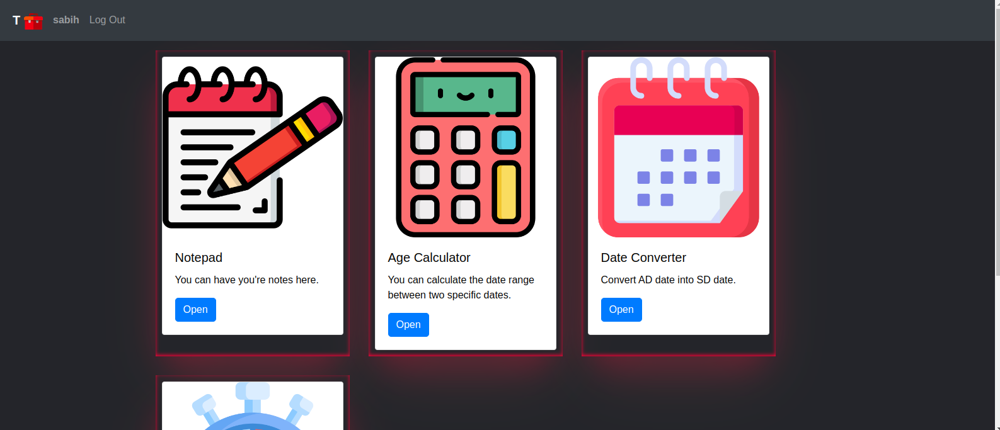
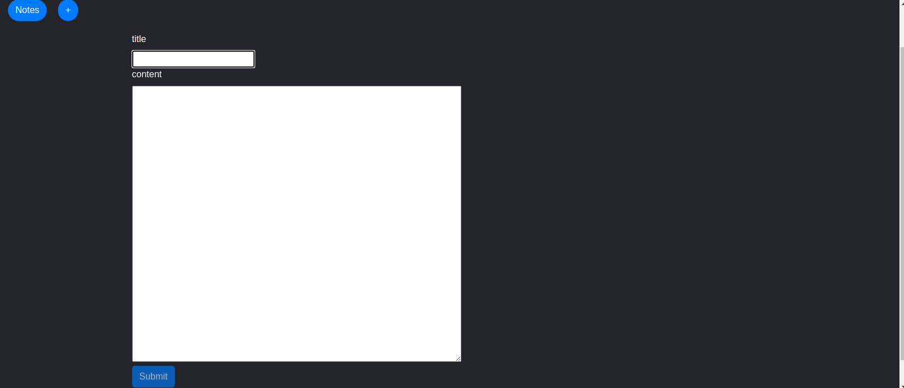
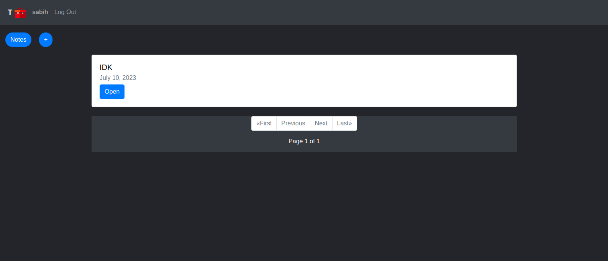
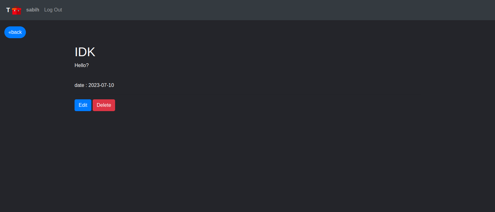
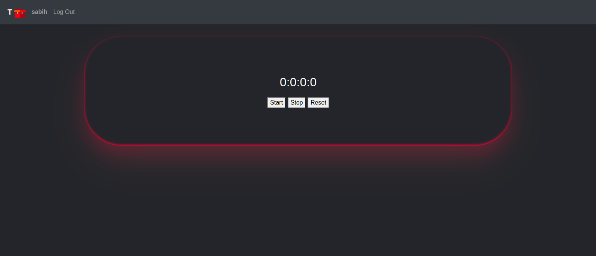
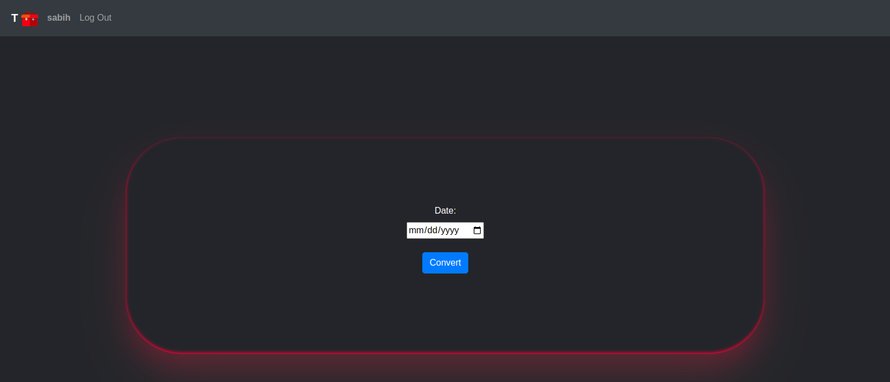

# Django Simple Toolbox

## About Project:

A toolbox that has collected several apps, the toolbox has Time tools, Date tools, and Notepad.
The user can register and log in, after logging in, the user can access the apps and use the toolbox.
The idea of this project is related to my first JavaFX project and I have tried to program and develop that project with Django.

- ### Notepad App :

  The user can write, edit and delete her/his notes in it. To write notes can use **Markdown**.
  The notes are sorted based on the time they were written so the newest note is higher than the rest.

  
  
  

  - #### What's Markdown?
    Markdown is a lightweight markup language that you can use to add formatting elements to plaintext text documents.
    [github markdown syntax](https://docs.github.com/en/get-started/writing-on-github/getting-started-with-writing-and-formatting-on-github/basic-writing-and-formatting-syntax)

- ### Time Tools App :

  Time tools app Includes a stopwatch to record time, used to time races.
  Time tools apps can develop to become more useful such as countdown timers and show timezones.
  

- ### Date Tools App :

  Date tools have two features:
  - #### Date Converter :
    Use to convert AD date into SD date.
    
  - #### Age Calculator :
    Users can calculate the date range between two specific dates.
    

### Technologies :

**Back-end** :

- _Python_
- _SQLite_

**Front-end** :

- _HTML_
- _CSS / Sass_
- _Java script_
- _Bootstrap_

## How to run the Project:

- Install project dependencies by running `pip install -r requirements.txt`
- Make and apply migrations by running `python manage.py makemigrations` and `python manage.py migrate`.

