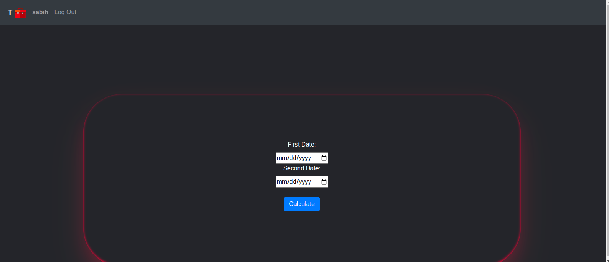

# CS50 Web Programming Final Project

## About Project:

I have created a toolbox which has collected several apps , the toolbox has Time tools , Date tools and Notepad.
User can register and login,after logging in, the user can access the apps and use toolbox.


- ### Notepad App :

  The user can write,edit and delete her/his notes in it.To writing notes can use **Markdown** .
  Each user can see a maximum of 10 notes in one page, and then the rest of the notes go to the next page.
  The notes are sorted based on the time they were written so the newest note is higher than the rest.
    - 
    - 
    - 
  - #### Whats Markdown?
    Markdown is a lightweight markup language that you can use to add formatting elements to plaintext text documents.
    [github markdown syntax](https://docs.github.com/en/get-started/writing-on-github/getting-started-with-writing-and-formatting-on-github/basic-writing-and-formatting-syntax)

- ### Time Tools App :

  Time tools app Includes a stopwatch to record time , used to time races.
  This stopwatch is based on milliseconds and has a start, stop and reset button.
  Time tools app can develope to become more useful such as countdown timer and show timezones.
  - 

- ### Date Tools App :
  Date tools have two features:
  - #### Date Converter :
    Use to convert AD date into SD date.
    
  - #### 2.Age Calculator :
    User can calculate the date range between two specific dates.
    


### Technologies :

**Back-end** :

- _Python_
- _SQLite_

**Front-end** :

- _HTML_
- _CSS / Sass_
- _Java script_
- _Bootstrap_

[Project video](https://youtu.be/09GLhTwTgoI)

## How to run the Project:

- Install project dependencies by running `pip install -r requirements.txt`
- Make and apply migrations by running `python manage.py makemigrations` and `python manage.py migrate`.

## Distinctiveness and Complexity:

Idea of this project is related to my first javaFX project and i have tried to program and develope that project with Django and this project is totally different from my previous CS50 projects.
i tried to use javascript more than before and i used forms in another way that connected to User model (forms.py file in account application) ,Techniques like flexbox are used and tried to have a responsive project to the different screen sizes.

# File structure description and summary

```
.
├── accounts
│   ├── admin.py
│   ├── apps.py
│   ├── forms.py
│   ├── __init__.py
│   ├── migrations
│   │   ├── 0001_initial.py
│   │   ├── __init__.py
│   │   └── __pycache__
│   ├── models.py
│   ├── __pycache__
│   ├── static
│   │   └── accounts
│   │       └── styles.css
│   ├── templates
│   │   └── accounts
│   │       ├── login.html
│   │       └── register.html
│   ├── tests.py
│   ├── urls.py
│   └── views.py
├── capstone
│   ├── asgi.py
│   ├── __init__.py
│   ├── __pycache__
│   ├── settings.py
│   ├── urls.py
│   └── wsgi.py
├── date_tools
│   ├── admin.py
│   ├── apps.py
│   ├── __init__.py
│   ├── migrations
│   │   ├── __init__.py
│   │   └── __pycache__
│   ├── models.py
│   ├── __pycache__
│   ├── static
│   │   └── date_tools
│   │       ├── index.js
│   │       └── styles.css
│   ├── templates
│   │   └── date_tools
│   │       ├── age_calculator.html
│   │       └── date_converter.html
│   ├── tests.py
│   ├── urls.py
│   └── views.py
├── db.sqlite3
├── manage.py
├── notepad
│   ├── admin.py
│   ├── apps.py
│   ├── __init__.py
│   ├── migrations
│   │   ├── 0001_initial.py
│   │   ├── __init__.py
│   │   └── __pycache__
│   ├── models.py
│   ├── __pycache__
│   ├── static
│   │   └── notepad
│   │       ├── index.js
│   │       └── styles.css
│   ├── templates
│   │   └── notepad
│   │       ├── index.html
│   │       ├── note_page.html
│   │       ├── notes_looks.html
│   │       └── page_navigation.html
│   ├── tests.py
│   ├── urls.py
│   └── views.py
├── Pipfile
├── Pipfile.lock
├── README.md
├── requirements.txt
├── time_tools
│   ├── admin.py
│   ├── apps.py
│   ├── __init__.py
│   ├── migrations
│   │   ├── __init__.py
│   │   └── __pycache__
│   ├── models.py
│   ├── __pycache__
│   ├── static
│   │   └── time_tools
│   │       ├── index.js
│   │       └── styles.css
│   ├── templates
│   │   └── time_tools
│   │       └── stopwatch.html
│   ├── tests.py
│   ├── urls.py
│   └── views.py
└── toolbox
    ├── admin.py
    ├── apps.py
    ├── __init__.py
    ├── migrations
    │   ├── __init__.py
    │   └── __pycache__
    ├── models.py
    ├── __pycache__
    ├── static
    │   └── toolbox
    │       ├── icons
    │       │   ├── calculator-icon.png
    │       │   ├── date-converter-icon.png
    │       │   ├── notepad-icon.png
    │       │   └── time.png
    │       ├── index.js
    │       ├── styles.css
    │       ├── styles.css.map
    │       ├── styles.scss
    │       └── toolbox-svgrepo-com.svg
    ├── templates
    │   └── toolbox
    │       ├── index.html
    │       └── layout.html
    ├── tests.py
    ├── urls.py
    └── views.py

```
